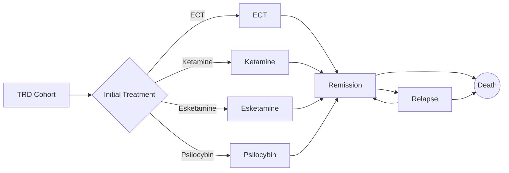

# Model Diagrams (Mermaid)

```mermaid
flowchart LR
  A[TRD Cohort] --> B{Initial Treatment}
  B -->|ECT| C[ECT]
  B -->|Ketamine| D[Ketamine]
  B -->|Esketamine| E[Esketamine]
  B -->|Psilocybin| F[Psilocybin]
  C --> R[Remission]; D --> R; E --> R; F --> R
  R --> Dep[Relapse]; Dep --> R
  R --> X((Death)); Dep --> X
```
