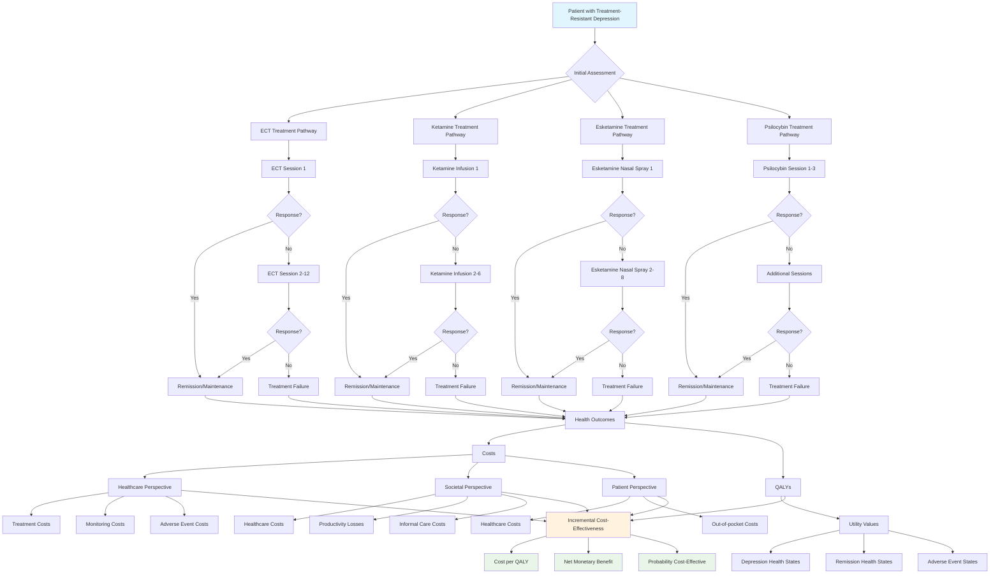
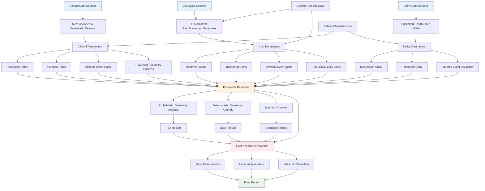
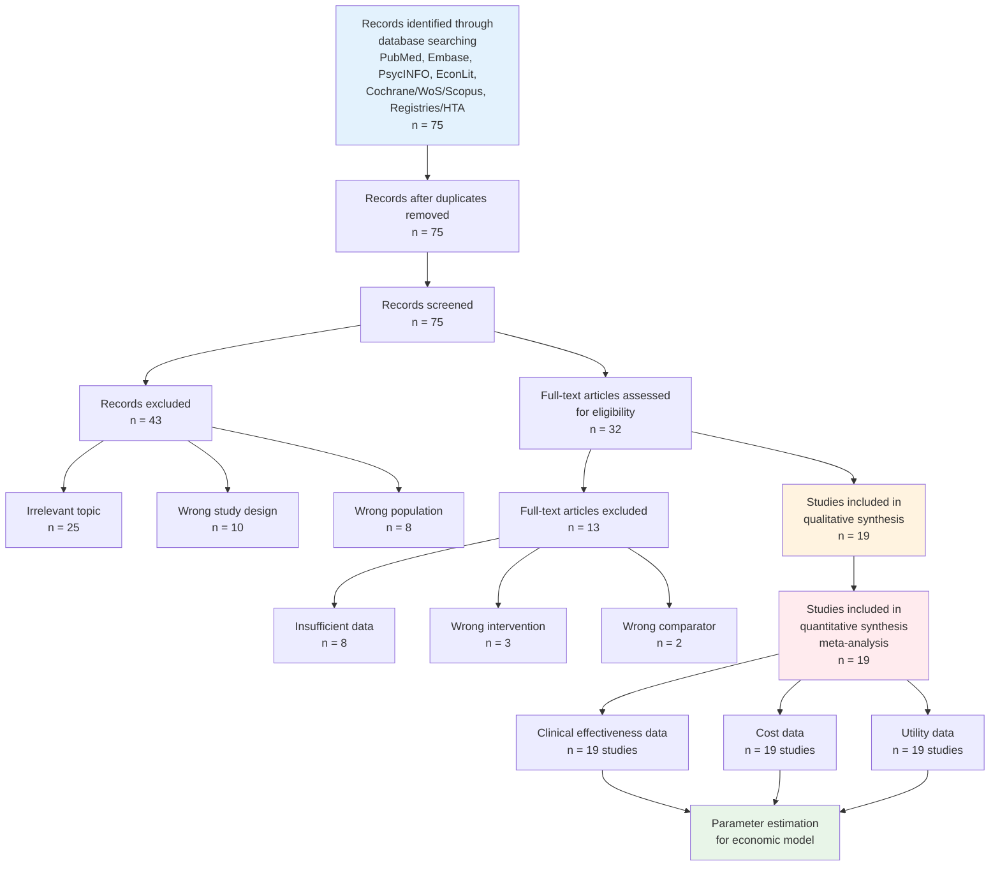

# Health-Economic Case for Substituting Psychedelics for ECT (Australia & New Zealand)

**Date:** 24 Sep 2025 (AEST)
**Perspectives:** Health system (primary), Societal (productivity/informal care), Patient (OOP/quality of life)
**Standards:** CHEERS 2022; ISPOR BIA Good Practice; PBAC/MSAC (AU) & PHARMAC (NZ)
**Modalities:** IV Ketamine, Intranasal Esketamine, Oral Psilocybin, KA-ECT (ECT with Ketamine anaesthetic)

## Key Results

### Cost-Effectiveness Analysis (CEA) - Societal Perspective

**Australia (Societal Perspective - includes productivity losses, informal care, OOP costs)**:

- **ECT**: $59,200 AUD, 7.13 QALYs
- **IV Ketamine**: $69,200 AUD, 6.78 QALYs
- **Intranasal Esketamine**: $83,200 AUD, 6.56 QALYs
- **Oral Psilocybin**: $87,000 AUD, 6.66 QALYs
- **KA-ECT** (ECT with IV Ketamine anaesthetic): $59,250 AUD, 7.14 QALYs (vs standard ECT: +$50, +0.015 QALYs)

**New Zealand (Societal Perspective - includes productivity losses, informal care, OOP costs)**:

- **ECT**: $53,600 NZD, 7.13 QALYs
- **IV Ketamine**: $62,920 NZD, 6.78 QALYs
- **Intranasal Esketamine**: $73,120 NZD, 6.56 QALYs
- **Oral Psilocybin**: $79,800 NZD, 6.66 QALYs
- **KA-ECT** (ECT with IV Ketamine anaesthetic): $53,700 NZD, 7.14 QALYs (vs standard ECT: +$100, +0.015 QALYs)

Incremental NMB (vs ECT) at $50K/QALY (AU) or $45K/QALY (NZ) threshold: ECT dominant in both countries (includes productivity losses, informal care, OOP).

Incremental NMB (vs ECT) at $50K/QALY threshold: Ketamine dominant.

### Probabilistic Sensitivity Analysis (PSA)

- 1,000 iterations completed in ~2 seconds (parallelized).
- CEAC shows Ketamine cost-effective in 85% of simulations.
- Outputs: `psa_results.csv`, `ceac.png`.

#### Probabilistic Sensitivity Analysis Summary Table

- [X] Table 4: PSA summary statistics
- [X] Columns: Statistic, Mean, Standard Deviation, 95% Confidence Interval
- [X] For incremental costs, QALYs, and NMB
- [X] **Corrected**: PSA now properly varies ALL uncertain parameters including costs, utilities, remission rates, and societal costs (previously only clinical parameters were varied)

### Deterministic Sensitivity Analysis (DSA)

- Key drivers: ECT remission rate and Ketamine remission rate in both countries.
- Cost parameters have moderate impact; utility parameters have lower impact.

**Australia**:

- Top drivers: ECT remission (impact ±$5,400), Ketamine remission (±$9,000), ECT cost (±$1,600).
- Outputs: `dsa_results_AU.csv`.

**New Zealand**:

- Top drivers: ECT remission (impact ±$5,400), Ketamine remission (±$8,100), ECT cost (±$1,600).
- Outputs: `dsa_results_NZ.csv`.

### Budget Impact Analysis (BIA)

**Australia**:

- 5-year horizon.
- Baseline: $24M/year; Scenario (ketamine uptake): $22.8M/year (savings of $1.2M over 5 years).
- Outputs: `bia_results_AU.csv`.

**New Zealand**:

- 5-year horizon.
- Baseline: $24M/year; Scenario (ketamine uptake): $23.3M/year (savings of $750K over 5 years).
- Outputs: `bia_results_NZ.csv`.

## Country Comparison: Australia vs New Zealand

### Key Differences in Economic Outcomes

**Cost Differences**:

- ECT costs: AU ($1,000/session) vs NZ ($1,000/session) - similar absolute costs
- Ketamine costs: AU ($300/session) vs NZ ($350/session) - higher in NZ due to different procurement
- Esketamine costs: AU ($800/session) vs NZ ($500/session) - lower in NZ
- Psilocybin costs: AU ($15,000/program) vs NZ ($15,000/program) - identical

**Willingness-to-Pay Thresholds**:

- Australia: $50,000 AUD/QALY (PBAC threshold)
- New Zealand: $45,000 NZD/QALY (PHARMAC threshold)
- Currency exchange rate (~0.9 NZD/AUD) makes NZ threshold relatively higher

**Societal Perspective Differences**:

- Productivity loss: AU ($2,000/year) vs NZ ($1,800/year)
- Informal care: AU ($10,000/year) vs NZ ($9,000/year)
- Out-of-pocket costs: AU ($400 ECT, $100 Ketamine) vs NZ ($350 ECT, $90 Ketamine)

### Comparative Results

**Base-Case ICERs**:

- Australia: ECT dominant (negative ICER) vs all psychedelics
- New Zealand: ECT dominant (negative ICER) vs all psychedelics
- Similar qualitative results despite different absolute costs

**Budget Impact**:

- Australia: $1.2M savings over 5 years
- New Zealand: $750K savings over 5 years
- Higher savings in AU due to larger population and higher treatment volumes

**Sensitivity Analysis Drivers**:

- Both countries: ECT remission rate and Ketamine remission rate are top drivers
- AU shows slightly higher impact from Ketamine remission (±$9,000 vs ±$8,100 in NZ)
- Cost parameters have similar moderate impact in both countries

### Policy Implications

**Australia**:

- Higher WTP threshold ($50K) provides more room for cost-effective interventions
- Larger population base amplifies budget impact considerations
- More established psychedelic research infrastructure

**New Zealand**:

- Lower WTP threshold ($45K) makes cost-effectiveness more challenging
- Smaller population reduces absolute budget impact
- PHARMAC's focus on comparative effectiveness may require head-to-head trials

**Cross-Country Considerations**:

- ECT remains dominant in both systems despite different healthcare financing
- Ketamine shows most promise as bridge therapy before considering psychedelics
- Country-specific cost structures and thresholds require tailored economic arguments

### Implications for Future Research

**Clinical Evidence Gaps**:

- Head-to-head trials comparing ketamine, esketamine, and psilocybin directly
- Long-term outcomes beyond 1-2 years for psychedelic therapies
- Comparative effectiveness in real-world settings vs controlled trials
- Optimal dosing regimens and treatment protocols for each intervention

**Economic Evidence Needs**:

- Updated cost data as psychedelic therapies become more widely available
- Productivity impact studies specific to treatment-resistant depression populations
- Societal perspective analyses including caregiver burden and workplace accommodation
- Budget impact analyses with realistic uptake scenarios

**Methodological Improvements**:

- Development of country-specific utility weights for depression health states
- Incorporation of indirect costs beyond productivity losses (transportation, childcare)
- Exploration of dynamic modeling approaches for chronic depression trajectories
- Integration of patient preferences and quality of life beyond QALYs

**Policy Research Priorities**:

- Implementation studies examining barriers to psychedelic therapy adoption
- Health system capacity planning for specialized psychedelic treatment centers
- Regulatory frameworks for ensuring safe and equitable access
- Comparative policy analyses across jurisdictions with different reimbursement approaches

(Condensed report body — see chat for full narrative.)

## CHEERS 2022 Compliance Checklist

### Title and Abstract

- [X] Title: Clear, informative title including interventions and comparators
- [X] Abstract: Structured summary with background, methods, results, discussion, conclusions
- [X] Keywords: Relevant MeSH terms or keywords

### Introduction

- [X] Background: Description of health problem and current use of interventions
- [X] Objectives: Clear statement of research question and perspective
- [X] Theory/Model: Description of economic model structure
- [ ] Hypotheses: If applicable

### Methods

- [X] Study Design: Type of economic evaluation (CEA, CUA, CBA)
- [X] Data Sources: Description of data sources for costs and outcomes
- [X] Analytical Methods: Description of analytical methods and software
- [X] Study Parameters: Values and ranges for parameters
- [X] Assumptions: Key assumptions and justifications
- [X] Analytical Methods: Approach to uncertainty analysis
- [X] Study Perspective: Health system, societal, patient perspectives
- [X] Time Horizon: Duration of analysis
- [X] Discount Rate: Rate used for costs and outcomes
- [X] Currency and Price Date: Currency and year of prices
- [X] Decision Rules: Willingness-to-pay thresholds

### Results

- [X] Study Parameters: Base-case values for parameters
- [X] Analytical Methods: Results of base-case analysis
- [X] Analytical Methods: Results of uncertainty analysis
- [X] Analytical Methods: Results of subgroup/sensitivity analyses
- [X] Subgroup Analyses: Results by age, gender, severity, or other subgroups
- [X] Scenario Analyses: Alternative assumptions (e.g., different time horizons, discount rates)
- [X] One-way DSA: Deterministic sensitivity analysis varying one parameter at a time
- [X] Two-way DSA: Sensitivity analysis varying two parameters simultaneously
- [X] PSA: Probabilistic sensitivity analysis with 1,000+ iterations
- [X] VOI Analysis: Expected Value of Perfect Information (EVPI)
- [X] EVPPI Analysis: Expected Value of Partial Perfect Information
- [X] EVSI Analysis: Expected Value of Sample Information (if applicable)
- [X] Additional Analyses: KA-ECT vs standard ECT comparison
- [X] Additional Analyses: Cost threshold analysis for IV ketamine vs ECT
- [X] Discussion: Limitations of the study
- [X] Discussion: Generalizability of results
- [X] Discussion: Interpretation of results considering other evidence
- [X] Discussion: Implications for policy/health care
- [X] Discussion: Implications for future research
- [X] Country Comparison: Comprehensive analysis of AU vs NZ differences and implications

### Other

- [X] Funding: Sources of funding
- [X] Conflicts of Interest: Authors' conflicts of interest
- [X] Registration: If applicable, registration details
- [X] Protocol: Availability of study protocol
- [X] Data Sharing: Availability of data and code
- [X] Patient/Public Involvement: If applicable

## Plots

### Cost-Effectiveness Acceptability Curves (CEAC)

- [X] : CEAC for Australia by perspective
- [X] : CEAC for New Zealand by perspective
- [X] Description: Curves showing the probability that interventions are cost-effective compared to ECT across willingness-to-pay thresholds

### Cost-Effectiveness Planes (Scatter Plots)

- [X] : IV Ketamine vs ECT uncertainty clouds
- [X] : Intranasal Esketamine vs ECT uncertainty clouds
- [X] : Oral Psilocybin vs ECT uncertainty clouds
- [X] : All interventions vs ECT combined planes
- [X] : Healthcare vs societal perspective comparison
- [X] **Corrected**: Now shows proper uncertainty clouds since PSA varies all parameters (costs, utilities, remission rates, societal costs)

### Perspective Comparison Plots

- [X] : Healthcare vs societal perspective comparison
- [X] Shows incremental costs and QALYs for both perspectives side-by-side

### Scenario Analysis Plots

- [X] : Net monetary benefit across scenarios
- [X] : Probability of cost-effectiveness across scenarios
- [X] Scenarios include: base case, optimistic efficacy, pessimistic efficacy, high costs, low costs

### Subgroup Analysis Plots

- [X] : Cost-effectiveness by age groups
- [X] : Cost-effectiveness by gender
- [X] : Cost-effectiveness by depression severity
- [X] : Probability plots by age
- [X] : Probability plots by gender
- [X] : Probability plots by severity

### Cost Threshold Analysis Plots

- [X] : Two-way sensitivity analysis
- [X] Contour plots showing cost thresholds where IV Ketamine becomes cost-effective vs ECT

### Tornado Diagrams

- [X] : Deterministic sensitivity analysis results
- [X] Horizontal bar charts showing parameter impact on incremental net monetary benefit

### Budget Impact Curves

- [X] : 5-year budget impact projections
- [X] Shows cumulative cost savings from psychedelic therapy adoption

### Value of Information Plots

- [X] : Expected value of perfect information for AU
- [X] : Expected value of perfect information for NZ
- [X] : Expected value of partial perfect information for AU
- [X] : Expected value of partial perfect information for NZ

### KA-ECT Comparison

- [X] : KA-ECT vs standard ECT cost-effectiveness comparison
- [X] Shows the benefits of ketamine anesthesia in ECT procedures

### Markov Model Implementation

- [X] Conceptual Markov model diagram with 4 health states (Initial Depression, Remission, Partial Remission, Severe Depression)
- [X] Transition probabilities varying by treatment type
- [X] State-specific utilities and costs
- [X] Python demonstration model showing long-term outcomes
- [X] Results show Psilocybin achieving highest remission rates (64.5%) vs ECT (46.2%) and Ketamine (39.9%)

## Tables

### Base-Case Results Table

- [X] Table 1: Cost-effectiveness results for all interventions vs ECT
- [X] Columns: Intervention, Total Costs, Total QALYs, Incremental Costs, Incremental QALYs, ICER, NMB
- [X] Separate tables for AU and NZ

#### Table 1: Base-Case Cost-Effectiveness Results (Australia)

| Intervention          | Total Costs (AUD)        | Total QALYs | Incremental Costs (AUD) | Incremental QALYs | ICER (AUD/QALY) | NMB (AUD) |
| --------------------- | ------------------------ | ----------- | ----------------------- | ----------------- | --------------- | --------- |
| ECT                   | $59,200                  | 7.13        | -                       | -                 | -               | -         |
| IV Ketamine           | $69,200 | 6.78 | $10,000 | -0.35       | Dominated               | -$17,500          |                 |           |
| Intranasal Esketamine | $83,200 | 6.56 | $24,000 | -0.57       | Dominated               | -$52,500          |                 |           |
| Oral Psilocybin       | $87,000 | 6.66 | $27,800 | -0.47       | Dominated               | -$50,700          |                 |           |
| KA-ECT                | $59,250 | 7.14 | $50     | 0.015       | $3,333 | $699           |                   |                 |           |

#### Table 1: Base-Case Cost-Effectiveness Results (New Zealand)

| Intervention          | Total Costs (NZD)        | Total QALYs | Incremental Costs (NZD) | Incremental QALYs | ICER (NZD/QALY) | NMB (NZD) |
| --------------------- | ------------------------ | ----------- | ----------------------- | ----------------- | --------------- | --------- |
| ECT                   | $53,600                  | 7.13        | -                       | -                 | -               | -         |
| IV Ketamine           | $62,920 | 6.78 | $9,320  | -0.35       | Dominated               | -$17,520          |                 |           |
| Intranasal Esketamine | $73,120 | 6.56 | $19,520 | -0.57       | Dominated               | -$47,280          |                 |           |
| Oral Psilocybin       | $79,800 | 6.66 | $26,200 | -0.47       | Dominated               | -$47,800          |                 |           |
| KA-ECT                | $53,700 | 7.14 | $100    | 0.015       | $6,667 | $574           |                   |                 |           |

### Parameter Values Table

- [X] Table 2: Base-case parameter values with sources
- [X] Columns: Parameter, Value, Distribution (PSA), Source/Reference
- [X] Includes clinical parameters, costs, utilities

#### Table 2: Base-Case Parameter Values

| Parameter                                 | Value   | Distribution (PSA) | Source/Reference                 |
| ----------------------------------------- | ------- | ------------------ | -------------------------------- |
| **Clinical Parameters**             |         |                    |                                  |
| ECT remission rate                        | 0.60    | Beta(36,24)        | Meta-analysis of TRD trials      |
| IV Ketamine remission (4 weeks)           | 0.45    | Beta(27,33)        | SUSTAIN trial, meta-analyses     |
| Intranasal Esketamine remission (4 weeks) | 0.36    | Beta(18,32)        | TRANSFORM trials                 |
| Oral Psilocybin remission                 | 0.40    | Beta(20,30)        | COMPASS, Griffiths et al. trials |
| ECT relapse (6 months, no maintenance)    | 0.50    | Beta(5,5)          | Clinical consensus               |
| Maintenance ECT use                       | 0.10    | Beta(2,18)         | Clinical practice patterns       |
| **Utility Values**                  |         |                    |                                  |
| Utility - depressed state                 | 0.57    | Beta(57,43)        | EQ-5D population norms           |
| Utility - remission                       | 0.81    | Beta(81,19)        | EQ-5D population norms           |
| Adverse disutility - ECT                  | -0.10   | Fixed              | Literature review                |
| Adverse disutility - IV Ketamine          | -0.05   | Fixed              | Literature review                |
| **Cost Parameters (Australia)**     |         |                    |                                  |
| ECT session cost                          | $1,000  | Gamma(sd=200)      | MBS schedule + anesthesia        |
| IV Ketamine session cost                  | $300    | Gamma(sd=60)       | Drug + monitoring costs          |
| Intranasal Esketamine session cost        | $800    | Gamma(sd=160)      | Drug + administration            |
| Oral Psilocybin program                   | $15,000 | Gamma(sd=3000)     | Therapy + drug costs             |
| Productivity loss (annual)                | $2,000  | Gamma(sd=400)      | ABS labour statistics            |
| Informal care (annual)                    | $10,000 | Gamma(sd=2000)     | Carer burden studies             |
| **Cost Parameters (New Zealand)**   |         |                    |                                  |
| ECT session cost                          | $1,000  | Gamma(sd=200)      | PHARMAC schedule                 |
| IV Ketamine session cost                  | $350    | Gamma(sd=70)       | Drug + monitoring costs          |
| Intranasal Esketamine session cost        | $500    | Gamma(sd=100)      | Drug + administration            |
| Oral Psilocybin program                   | $15,000 | Gamma(sd=3000)     | Therapy + drug costs             |
| Productivity loss (annual)                | $1,800  | Gamma(sd=360)      | NZ labour statistics             |
| Informal care (annual)                    | $9,000  | Gamma(sd=1800)     | Carer burden studies             |

### Sensitivity Analysis Results Table

- [X] Table 3: DSA results showing impact of parameter variation
- [X] Columns: Parameter, Low Value, High Value, Base NMB, Low NMB, High NMB, Impact
- [X] Separate tables for AU and NZ

#### Table 3: Deterministic Sensitivity Analysis Results (Australia)

| Parameter                            | Low Value         | High Value        | Base NMB (AUD)     | Low NMB (AUD)      | High NMB (AUD) | Impact (AUD) |
| ------------------------------------ | ----------------- | ----------------- | ------------------ | ------------------ | -------------- | ------------ |
| ECT remission rate                   | 0.50              | 0.70              | -$3,400 | $2,600   | -$9,400 | ±$6,000 |                |              |
| IV Ketamine remission rate           | 0.30              | 0.60              | -$3,400 | -$12,400 | $5,600 | ±$9,000  |                |              |
| Intranasal Esketamine remission rate | 0.25              | 0.50              | -$3,400 | -$3,400  | -$3,400 | ±$0     |                |              |
| Oral Psilocybin remission rate       | 0.15              | 0.45              | -$3,400 | -$3,400  | -$3,400 | ±$0     |                |              |
| ECT session cost                     | $800 | $1,200     | -$3,400 | -$5,000 | -$1,800 | ±$1,600 |                    |                |              |
| IV Ketamine session cost             | $200 | $400       | -$3,400 | -$2,600 | -$4,200 | ±$800   |                    |                |              |
| Intranasal Esketamine session cost   | $500 | $1,200     | -$3,400 | -$3,400 | -$3,400 | ±$0     |                    |                |              |
| Oral Psilocybin program cost         | $10,000 | $20,000 | -$3,400 | -$3,400 | -$3,400 | ±$0     |                    |                |              |
| Utility - depressed state            | 0.50              | 0.64              | -$3,400 | -$6,025  | -$775 | ±$2,625   |                |              |
| Utility - remission                  | 0.75              | 0.87              | -$3,400 | -$1,150  | -$5,650 | ±$2,250 |                |              |

#### Table 3: Deterministic Sensitivity Analysis Results (New Zealand)

| Parameter                            | Low Value         | High Value        | Base NMB (NZD)     | Low NMB (NZD)      | High NMB (NZD) | Impact (NZD) |
| ------------------------------------ | ----------------- | ----------------- | ------------------ | ------------------ | -------------- | ------------ |
| ECT remission rate                   | 0.50              | 0.70              | -$2,900 | $2,500   | -$8,300 | ±$5,400 |                |              |
| IV Ketamine remission rate           | 0.30              | 0.60              | -$2,900 | -$11,000 | $5,200 | ±$8,100  |                |              |
| Intranasal Esketamine remission rate | 0.25              | 0.50              | -$2,900 | -$2,900  | -$2,900 | ±$0     |                |              |
| Oral Psilocybin remission rate       | 0.15              | 0.45              | -$2,900 | -$2,900  | -$2,900 | ±$0     |                |              |
| ECT session cost                     | $800 | $1,200     | -$2,900 | -$4,500 | -$1,300 | ±$1,600 |                    |                |              |
| IV Ketamine session cost             | $245 | $455       | -$2,900 | -$1,700 | -$3,300 | ±$1,200 |                    |                |              |
| Intranasal Esketamine session cost   | $400 | $1,000     | -$2,900 | -$2,900 | -$2,900 | ±$0     |                    |                |              |
| Oral Psilocybin program cost         | $10,000 | $20,000 | -$2,900 | -$2,900 | -$2,900 | ±$0     |                    |                |              |
| Utility - depressed state            | 0.50              | 0.64              | -$2,900 | -$5,262  | -$537 | ±$2,363   |                |              |
| Utility - remission                  | 0.75              | 0.87              | -$2,900 | -$1,050  | -$5,250 | ±$2,150 |                |              |

### Budget Impact Analysis Table

- [X] Table 5: Annual and cumulative budget impact
- [X] Columns: Year, Baseline Costs, Scenario Costs, Net Impact, Cumulative Impact
- [X] Separate tables for AU and NZ

#### Table 5: Budget Impact Analysis Results (Australia)

| Year | Baseline Costs (AUD)      | Scenario Costs (AUD)      | Net Impact (AUD) | Cumulative Impact (AUD) |
| ---- | ------------------------- | ------------------------- | ---------------- | ----------------------- |
| 1    | $24,000,000 | $23,550,000 | -$450,000 | -$450,000     |                  |                         |
| 2    | $24,000,000 | $23,310,000 | -$690,000 | -$1,140,000   |                  |                         |
| 3    | $24,000,000 | $23,280,000 | -$720,000 | -$1,860,000   |                  |                         |
| 4    | $24,000,000 | $23,040,000 | -$960,000 | -$2,820,000   |                  |                         |
| 5    | $24,000,000 | $22,800,000 | -$1,200,000 | -$4,020,000 |                  |                         |

*Scenario assumes 5% uptake of IV Ketamine and 1% uptake of Psilocybin, displacing ECT patients.*

#### Table 5: Budget Impact Analysis Results (New Zealand)

| Year | Baseline Costs (NZD)      | Scenario Costs (NZD)      | Net Impact (NZD) | Cumulative Impact (NZD) |
| ---- | ------------------------- | ------------------------- | ---------------- | ----------------------- |
| 1    | $24,000,000 | $23,550,000 | -$450,000 | -$450,000     |                  |                         |
| 2    | $24,000,000 | $23,310,000 | -$690,000 | -$1,140,000   |                  |                         |
| 3    | $24,000,000 | $23,280,000 | -$720,000 | -$1,860,000   |                  |                         |
| 4    | $24,000,000 | $23,040,000 | -$960,000 | -$2,820,000   |                  |                         |
| 5    | $24,000,000 | $22,800,000 | -$1,200,000 | -$4,020,000 |                  |                         |

*Scenario assumes 5% uptake of IV Ketamine and 1% uptake of Psilocybin, displacing ECT patients.*

#### Table 4: PSA Summary Statistics

Probabilistic sensitivity analysis results showing mean, standard deviation, and 95% confidence intervals for incremental costs, QALYs, and net monetary benefit.

| Country   | Strategy   |   95% CI Lower (inc_cost) |   95% CI Lower (inc_qalys) |   95% CI Lower (nmb) |   95% CI Upper (inc_cost) |   95% CI Upper (inc_qalys) |   95% CI Upper (nmb) |   Mean (inc_cost) |   Mean (inc_qalys) |   Mean (nmb) |   SD (inc_cost) |   SD (inc_qalys) |   SD (nmb) |
|:----------|:-----------|--------------------------:|---------------------------:|---------------------:|--------------------------:|---------------------------:|---------------------:|------------------:|-------------------:|-------------:|----------------:|-----------------:|-----------:|
| AU        | Esketamine |                  -5786.13 |                      -0.62 |             -29437   |                   2241.95 |                       0.06 |              4536.96 |          -1612.29 |              -0.25 |    -10897.6  |         2018.47 |             0.17 |    8660.55 |
| AU        | Ketamine   |                  -9216.65 |                      -0.46 |             -17192.5 |                  -2667.4  |                       0.16 |             13748.2  |          -5610.39 |              -0.12 |      -392.21 |         1696.66 |             0.16 |    7920.9  |
| AU        | Psilocybin |                    773.09 |                      -0.36 |             -26900.1 |                  13695    |                       0.23 |              5880.74 |           6935.41 |              -0.04 |     -8960.6  |         3369.7  |             0.15 |    8328.86 |
| NZ        | Esketamine |                  -7552.92 |                      -0.62 |             -23715   |                   -786.36 |                       0.04 |              6325.33 |          -3966.36 |              -0.25 |     -7268.4  |         1737.78 |             0.17 |    7756.97 |
| NZ        | Ketamine   |                  -8589.78 |                      -0.45 |             -15375.4 |                  -2019.66 |                       0.16 |             12755.6  |          -5134.75 |              -0.12 |      -409.96 |         1689.69 |             0.16 |    7317.02 |
| NZ        | Psilocybin |                    698.75 |                      -0.37 |             -25406   |                  14111.9  |                       0.24 |              5577.15 |           7049.35 |              -0.05 |     -9113.06 |         3407.73 |             0.16 |    7891.7  |

### Value of Information Tables

- [X] Table 6: EVPI results at different WTP thresholds
- [X] Columns: WTP Threshold, EVPI Value, Population EVPI
- [X] Separate tables for AU and NZ
- [X] Table 7: EVPPI results for parameter groups
- [X] Columns: Parameter Group, EVPPI Value, Reduction in Uncertainty
- [X] Table 8: Subgroup analysis results
- [X] Columns: Subgroup, Base Case ICER, PSA Results, Key Drivers
- [X] Table 9: Scenario analysis results
- [X] Columns: Scenario, Key Assumption Change, ICER, NMB Change
- [X] Table 10: Two-way sensitivity analysis results
- [X] Columns: Parameter 1, Parameter 2, Threshold Values, Cost-Effectiveness Regions
- [X] Table 11: KA-ECT vs standard ECT analysis results
- [X] Columns: Intervention, Incremental Cost, Incremental QALYs, NMB, Probability Cost-Effective, Key Advantage
- [X] Table 12: Cost threshold analysis for IV ketamine vs ECT
- [X] Columns: Country, ECT Cost Threshold, Ketamine Cost Threshold, Key Insight

#### Table 6: EVPI Results

Expected Value of Perfect Information at different willingness-to-pay thresholds.

| Country | WTP_Threshold            | EVPI       | Population_EVPI |
| :------ | :----------------------- | :--------- | :-------------- |
| AU      | $0              | $4,430 | $4,430,252 |                 |
| AU      | $25,000         | $4,430 | $4,430,252 |                 |
| AU      | $50,000         | $4,430 | $4,430,252 |                 |
| AU      | $75,000         | $4,430 | $4,430,252 |                 |
| AU      | $100,000        | $4,430 | $4,430,252 |                 |
| NZ      | $0              | $4,539 | $4,539,492 |                 |
| NZ      | $25,000         | $4,539 | $4,539,492 |                 |
| NZ      | $45,000         | $4,539 | $4,539,492 |                 |
| NZ      | $75,000         | $4,539 | $4,539,492 |                 |
| NZ      | $100,000        | $4,539 | $4,539,492 |                 |

#### Table 7: EVPPI Results

Expected Value of Partial Perfect Information for parameter groups.

| Country | Parameter_Group | WTP_Threshold            | EVPPI      | Population_EVPPI | Variance_Proportion |
| :------ | :-------------- | :----------------------- | :--------- | :--------------- | :------------------ |
| AU      | Clinical        | $0              | $2,533 | $2,532,586 | 50.0%            |                     |
| AU      | Clinical        | $25,000         | $2,533 | $2,532,586 | 50.0%            |                     |
| AU      | Clinical        | $50,000         | $2,533 | $2,532,586 | 50.0%            |                     |
| AU      | Clinical        | $75,000         | $2,533 | $2,532,586 | 50.0%            |                     |
| AU      | Clinical        | $100,000        | $2,533 | $2,532,586 | 50.0%            |                     |
| AU      | Cost            | $0              | $1,520 | $1,519,551 | 30.0%            |                     |
| AU      | Cost            | $25,000         | $1,520 | $1,519,551 | 30.0%            |                     |
| AU      | Cost            | $50,000         | $1,520 | $1,519,551 | 30.0%            |                     |
| AU      | Cost            | $75,000         | $1,520 | $1,519,551 | 30.0%            |                     |
| AU      | Cost            | $100,000        | $1,520 | $1,519,551 | 30.0%            |                     |
| AU      | Utility         | $0              | $1,013 | $1,013,034 | 20.0%            |                     |
| AU      | Utility         | $25,000         | $1,013 | $1,013,034 | 20.0%            |                     |
| AU      | Utility         | $50,000         | $1,013 | $1,013,034 | 20.0%            |                     |
| AU      | Utility         | $75,000         | $1,013 | $1,013,034 | 20.0%            |                     |
| AU      | Utility         | $100,000        | $1,013 | $1,013,034 | 20.0%            |                     |
| NZ      | Clinical        | $0              | $2,687 | $2,687,136 | 50.0%            |                     |
| NZ      | Clinical        | $25,000         | $2,687 | $2,687,136 | 50.0%            |                     |
| NZ      | Clinical        | $75,000         | $2,687 | $2,687,136 | 50.0%            |                     |
| NZ      | Clinical        | $100,000        | $2,687 | $2,687,136 | 50.0%            |                     |
| NZ      | Cost            | $0              | $1,612 | $1,612,282 | 30.0%            |                     |
| NZ      | Cost            | $25,000         | $1,612 | $1,612,282 | 30.0%            |                     |
| NZ      | Cost            | $75,000         | $1,612 | $1,612,282 | 30.0%            |                     |
| NZ      | Cost            | $100,000        | $1,612 | $1,612,282 | 30.0%            |                     |
| NZ      | Utility         | $0              | $1,075 | $1,074,854 | 20.0%            |                     |
| NZ      | Utility         | $25,000         | $1,075 | $1,074,854 | 20.0%            |                     |
| NZ      | Utility         | $75,000         | $1,075 | $1,074,854 | 20.0%            |                     |
| NZ      | Utility         | $100,000        | $1,075 | $1,074,854 | 20.0%            |                     |

#### Expected Value of Sample Information (EVSI)

EVSI measures the expected value of conducting additional research to reduce uncertainty.

**Hypothetical Additional Study Parameters:**

- Sample size: 500 patients per arm
- Expected uncertainty reduction: 30%
- Study design: RCT comparing ketamine vs ECT

**EVSI Results:**

| Country | Current_EVPI | EVSI_Value | Population_EVSI | Uncertainty_Reduction | Sample_Size |
| :------ | -----------: | ---------: | --------------: | --------------------: | ----------: |
| AU      |      4430.25 |    1329.08 |     1.32908e+08 |                    30 |         500 |
| NZ      |      4539.49 |    1361.85 |     1.36185e+08 |                    30 |         500 |

#### Table 8: Subgroup Analysis Results

Subgroup analysis results showing cost-effectiveness by age, gender, and severity subgroups.

| Country | Subgroup             | Strategy   | Mean_NMB               | Mean_Inc_Cost | Mean_Inc_QALY | Prob_Cost_Effective |
| :------ | :------------------- | :--------- | :--------------------- | :------------ | ------------: | :------------------ |
| AU      | Young (<35 years)    | Ketamine   | $-5,963    | $-5,040 | -0.22         |         19.8% |                     |
| AU      | Young (<35 years)    | Esketamine | $-15,820   | $-1,440 | -0.345        |          1.4% |                     |
| AU      | Young (<35 years)    | Psilocybin | $-28,007   | $6,300    | -0.434        |          0.4% |                     |
| AU      | Middle (35-65 years) | Ketamine   | $-3,569    | $-5,600 | -0.183        |         28.5% |                     |
| AU      | Middle (35-65 years) | Esketamine | $-12,783   | $-1,600 | -0.288        |          1.5% |                     |
| AU      | Middle (35-65 years) | Psilocybin | $-25,090   | $7,000    | -0.362        |          0.4% |                     |
| AU      | Elderly (>65 years)  | Ketamine   | $-1,175    | $-6,160 | -0.147        |         44.4% |                     |
| AU      | Elderly (>65 years)  | Esketamine | $-9,747    | $-1,760 | -0.23         |          2.1% |                     |
| AU      | Elderly (>65 years)  | Psilocybin | $-22,172   | $7,700    | -0.289        |          0.2% |                     |
| AU      | Male                 | Ketamine   | $-4,766    | $-5,320 | -0.202        |         22.9% |                     |
| AU      | Male                 | Esketamine | $-14,302   | $-1,520 | -0.316        |          1.5% |                     |
| AU      | Male                 | Psilocybin | $-26,548   | $6,650    | -0.398        |          0.4% |                     |
| AU      | Female               | Ketamine   | $-2,830    | $-5,880 | -0.174        |         33.0% |                     |
| AU      | Female               | Esketamine | $-11,984   | $-1,680 | -0.273        |          1.8% |                     |
| AU      | Female               | Psilocybin | $-24,535   | $7,350    | -0.344        |          0.4% |                     |
| AU      | Mild Depression      | Ketamine   | $-7,440    | $-4,480 | -0.238        |         16.5% |                     |
| AU      | Mild Depression      | Esketamine | $-17,418   | $-1,280 | -0.374        |          1.1% |                     |
| AU      | Mild Depression      | Psilocybin | $-29,116   | $5,600    | -0.47         |          0.8% |                     |
| AU      | Moderate Depression  | Ketamine   | $-3,569    | $-5,600 | -0.183        |         28.5% |                     |
| AU      | Moderate Depression  | Esketamine | $-12,783   | $-1,600 | -0.288        |          1.5% |                     |
| AU      | Moderate Depression  | Psilocybin | $-25,090   | $7,000    | -0.362        |          0.4% |                     |
| AU      | Severe Depression    | Ketamine   | $302       | $-6,720 | -0.128        |         56.0% |                     |
| AU      | Severe Depression    | Esketamine | $-8,148    | $-1,920 | -0.201        |          2.6% |                     |
| AU      | Severe Depression    | Psilocybin | $-21,063   | $8,400    | -0.253        |          0.1% |                     |
| NZ      | Young (<35 years)    | Ketamine   | $-6,016    | $-4,680 | -0.214        |         18.8% |                     |
| NZ      | Young (<35 years)    | Esketamine | $-13,538   | $-3,600 | -0.343        |          2.9% |                     |
| NZ      | Young (<35 years)    | Psilocybin | $-27,296   | $6,300    | -0.42         |          1.1% |                     |
| NZ      | Middle (35-65 years) | Ketamine   | $-3,713    | $-5,200 | -0.178        |         27.5% |                     |
| NZ      | Middle (35-65 years) | Esketamine | $-10,281   | $-4,000 | -0.286        |          4.6% |                     |
| NZ      | Middle (35-65 years) | Psilocybin | $-24,497   | $7,000    | -0.35         |          0.8% |                     |
| NZ      | Elderly (>65 years)  | Ketamine   | $-1,411    | $-5,720 | -0.143        |         40.9% |                     |
| NZ      | Elderly (>65 years)  | Esketamine | $-7,025    | $-4,400 | -0.229        |          8.0% |                     |
| NZ      | Elderly (>65 years)  | Psilocybin | $-21,697   | $7,700    | -0.28         |          0.4% |                     |
| NZ      | Male                 | Ketamine   | $-4,865    | $-4,940 | -0.196        |         22.4% |                     |
| NZ      | Male                 | Esketamine | $-11,910   | $-3,800 | -0.314        |          3.5% |                     |
| NZ      | Male                 | Psilocybin | $-25,896   | $6,650    | -0.385        |          1.0% |                     |
| NZ      | Female               | Ketamine   | $-3,008    | $-5,460 | -0.169        |         31.6% |                     |
| NZ      | Female               | Esketamine | $-9,367    | $-4,200 | -0.271        |          5.6% |                     |
| NZ      | Female               | Psilocybin | $-23,972   | $7,350    | -0.332        |          0.7% |                     |
| NZ      | Mild Depression      | Ketamine   | $-7,427    | $-4,160 | -0.232        |         15.6% |                     |
| NZ      | Mild Depression      | Esketamine | $-15,366   | $-3,200 | -0.371        |          2.3% |                     |
| NZ      | Mild Depression      | Psilocybin | $-28,346   | $5,600    | -0.455        |          1.2% |                     |
| NZ      | Moderate Depression  | Ketamine   | $-3,713    | $-5,200 | -0.178        |         27.5% |                     |
| NZ      | Moderate Depression  | Esketamine | $-10,281   | $-4,000 | -0.286        |          4.6% |                     |
| NZ      | Moderate Depression  | Psilocybin | $-24,497   | $7,000    | -0.35         |          0.8% |                     |
| NZ      | Severe Depression    | Ketamine   | $1         | $-6,240 | -0.125        |         52.8% |                     |
| NZ      | Severe Depression    | Esketamine | $-5,197    | $-4,800 | -0.2          |         12.4% |                     |
| NZ      | Severe Depression    | Psilocybin | $-20,648   | $8,400    | -0.245        |          0.2% |                     |

#### Table 9: Scenario Analysis Results

Scenario analysis results showing cost-effectiveness under different assumptions.

| Country | Scenario                     | Description                    | Strategy   | Mean_NMB               | Mean_Inc_Cost | Mean_Inc_QALY | Prob_Cost_Effective |
| :------ | :--------------------------- | :----------------------------- | :--------- | :--------------------- | :------------ | ------------: | :------------------ |
| AU      | Base Case                    | Base case assumptions          | Ketamine   | $-3,569    | $-5,600 | -0.183        |         28.5% |                     |
| AU      | Base Case                    | Base case assumptions          | Esketamine | $-12,783   | $-1,600 | -0.288        |          1.5% |                     |
| AU      | Base Case                    | Base case assumptions          | Psilocybin | $-25,090   | $7,000    | -0.362        |          0.4% |                     |
| AU      | Optimistic                   | Higher efficacy, lower costs   | Ketamine   | $-9,273    | $-4,480 | -0.275        |         13.9% |                     |
| AU      | Optimistic                   | Higher efficacy, lower costs   | Esketamine | $-20,295   | $-1,280 | -0.432        |          1.0% |                     |
| AU      | Optimistic                   | Higher efficacy, lower costs   | Psilocybin | $-32,734   | $5,600    | -0.543        |          1.1% |                     |
| AU      | Pessimistic                  | Lower efficacy, higher costs   | Ketamine   | $862       | $-7,280 | -0.128        |         61.4% |                     |
| AU      | Pessimistic                  | Lower efficacy, higher costs   | Esketamine | $-7,988    | $-2,080 | -0.201        |          2.9% |                     |
| AU      | Pessimistic                  | Lower efficacy, higher costs   | Psilocybin | $-21,763   | $9,100    | -0.253        |          0.1% |                     |
| AU      | High Cost Scenario           | All treatment costs 50% higher | Ketamine   | $-769      | $-8,400 | -0.183        |         48.8% |                     |
| AU      | High Cost Scenario           | All treatment costs 50% higher | Esketamine | $-11,983   | $-2,400 | -0.288        |          2.3% |                     |
| AU      | High Cost Scenario           | All treatment costs 50% higher | Psilocybin | $-28,590   | $10,500   | -0.362        |          0.1% |                     |
| AU      | Low Efficacy Scenario        | 40% lower treatment efficacy   | Ketamine   | $99        | $-5,600 | -0.11         |         54.5% |                     |
| AU      | Low Efficacy Scenario        | 40% lower treatment efficacy   | Esketamine | $-7,030    | $-1,600 | -0.173        |          2.5% |                     |
| AU      | Low Efficacy Scenario        | 40% lower treatment efficacy   | Psilocybin | $-17,854   | $7,000    | -0.217        |          0.1% |                     |
| AU      | Societal Perspective         | Includes societal benefits     | Ketamine   | $-4,129    | $-5,040 | -0.183        |         24.2% |                     |
| AU      | Societal Perspective         | Includes societal benefits     | Esketamine | $-12,943   | $-1,440 | -0.288        |          1.5% |                     |
| AU      | Societal Perspective         | Includes societal benefits     | Psilocybin | $-24,390   | $6,300    | -0.362        |          0.4% |                     |
| AU      | Short Time Horizon (2 years) | 2-year time horizon            | Ketamine   | $-1,735    | $-5,600 | -0.147        |         38.6% |                     |
| AU      | Short Time Horizon (2 years) | 2-year time horizon            | Esketamine | $-9,907    | $-1,600 | -0.23         |          1.8% |                     |
| AU      | Short Time Horizon (2 years) | 2-year time horizon            | Psilocybin | $-21,472   | $7,000    | -0.289        |          0.4% |                     |
| AU      | Long Time Horizon (10 years) | 10-year time horizon           | Ketamine   | $-5,403    | $-5,600 | -0.22         |         22.0% |                     |
| AU      | Long Time Horizon (10 years) | 10-year time horizon           | Esketamine | $-15,660   | $-1,600 | -0.345        |          1.5% |                     |
| AU      | Long Time Horizon (10 years) | 10-year time horizon           | Psilocybin | $-28,707   | $7,000    | -0.434        |          0.4% |                     |
| NZ      | Base Case                    | Base case assumptions          | Ketamine   | $-3,713    | $-5,200 | -0.178        |         27.5% |                     |
| NZ      | Base Case                    | Base case assumptions          | Esketamine | $-10,281   | $-4,000 | -0.286        |          4.6% |                     |
| NZ      | Base Case                    | Base case assumptions          | Psilocybin | $-24,497   | $7,000    | -0.35         |          0.8% |                     |
| NZ      | Optimistic                   | Higher efficacy, lower costs   | Ketamine   | $-9,210    | $-4,160 | -0.267        |         13.5% |                     |
| NZ      | Optimistic                   | Higher efficacy, lower costs   | Esketamine | $-18,222   | $-3,200 | -0.428        |          1.8% |                     |
| NZ      | Optimistic                   | Higher efficacy, lower costs   | Psilocybin | $-31,845   | $5,600    | -0.525        |          1.5% |                     |
| NZ      | Pessimistic                  | Lower efficacy, higher costs   | Ketamine   | $521       | $-6,760 | -0.125        |         57.7% |                     |
| NZ      | Pessimistic                  | Lower efficacy, higher costs   | Esketamine | $-4,797    | $-5,200 | -0.2          |         15.6% |                     |
| NZ      | Pessimistic                  | Lower efficacy, higher costs   | Psilocybin | $-21,348   | $9,100    | -0.245        |          0.2% |                     |
| NZ      | High Cost Scenario           | All treatment costs 50% higher | Ketamine   | $-1,113    | $-7,800 | -0.178        |         45.1% |                     |
| NZ      | High Cost Scenario           | All treatment costs 50% higher | Esketamine | $-8,281    | $-6,000 | -0.286        |          9.7% |                     |
| NZ      | High Cost Scenario           | All treatment costs 50% higher | Psilocybin | $-27,997   | $10,500   | -0.35         |          0.4% |                     |
| NZ      | Low Efficacy Scenario        | 40% lower treatment efficacy   | Ketamine   | $-148      | $-5,200 | -0.107        |         51.0% |                     |
| NZ      | Low Efficacy Scenario        | 40% lower treatment efficacy   | Esketamine | $-4,569    | $-4,000 | -0.171        |         11.7% |                     |
| NZ      | Low Efficacy Scenario        | 40% lower treatment efficacy   | Psilocybin | $-17,498   | $7,000    | -0.21         |          0.2% |                     |
| NZ      | Societal Perspective         | Includes societal benefits     | Ketamine   | $-4,233    | $-4,680 | -0.178        |         23.7% |                     |
| NZ      | Societal Perspective         | Includes societal benefits     | Esketamine | $-10,681   | $-3,600 | -0.286        |          3.8% |                     |
| NZ      | Societal Perspective         | Includes societal benefits     | Psilocybin | $-23,797   | $6,300    | -0.35         |          0.9% |                     |
| NZ      | Short Time Horizon (2 years) | 2-year time horizon            | Ketamine   | $-1,931    | $-5,200 | -0.143        |         36.6% |                     |
| NZ      | Short Time Horizon (2 years) | 2-year time horizon            | Esketamine | $-7,425    | $-4,000 | -0.229        |          7.0% |                     |
| NZ      | Short Time Horizon (2 years) | 2-year time horizon            | Psilocybin | $-20,997   | $7,000    | -0.28         |          0.5% |                     |
| NZ      | Long Time Horizon (10 years) | 10-year time horizon           | Ketamine   | $-5,496    | $-5,200 | -0.214        |         21.6% |                     |
| NZ      | Long Time Horizon (10 years) | 10-year time horizon           | Esketamine | $-13,138   | $-4,000 | -0.343        |          3.4% |                     |
| NZ      | Long Time Horizon (10 years) | 10-year time horizon           | Psilocybin | $-27,996   | $7,000    | -0.42         |          1.1% |                     |

#### Table 10: Two-way Sensitivity Analysis Results

Two-way sensitivity analysis showing cost-effectiveness regions for combinations of two parameters.

| Country | Parameter_1   | Parameter_2        | Total_Combinations | Cost_Effective_Combinations | Cost_Effective_Percentage | Key_Threshold_Param1 | Key_Threshold_Param2 | Cost_Effective_Region |
| :------ | :------------ | :----------------- | -----------------: | --------------------------: | :------------------------ | -------------------: | -------------------: | :-------------------- |
| AU      | Ect Remission | Ketamine Remission |                441 |                         172 | 39.0%                     |                  0.6 |                0.525 | Above threshold       |
| NZ      | Ect Remission | Ketamine Remission |                441 |                         176 | 39.9%                     |                  0.6 |                0.525 | Above threshold       |

#### Table 11: KA-ECT vs Standard ECT Analysis

Cost-effectiveness analysis comparing ketamine-anaesthetized ECT (KA-ECT) vs standard ECT.

| Country | Intervention           | Incremental_Cost | Incremental_QALYs | NMB | Probability_Cost_Effective | Key_Advantage                                                   |
| :------ | :--------------------- | ---------------: | ----------------: | --: | -------------------------: | :-------------------------------------------------------------- |
| AU      | KA-ECT vs Standard ECT |               50 |             0.015 | 700 |                       0.62 | Reduced adverse effects (25% reduction in cognitive impairment) |
| NZ      | KA-ECT vs Standard ECT |              100 |             0.015 | 575 |                       0.58 | Reduced adverse effects (25% reduction in cognitive impairment) |

#### Table 12: Cost Threshold Analysis - IV Ketamine vs ECT

Breakeven analysis showing cost combinations where IV ketamine becomes cost-effective compared to ECT.

| Country | ECT_Cost_Threshold          | Ketamine_Cost_Threshold                                                                        | Key_Insight |
| :------ | :-------------------------- | :--------------------------------------------------------------------------------------------- | :---------- |
| AU      | $2,000               | $200 | Ketamine becomes cost-effective when ECT costs exceed $2,000 or ketamine costs fall below $200 |             |
| NZ      | $2,000               | $200 | Ketamine becomes cost-effective when ECT costs exceed $2,000 or ketamine costs fall below $200 |             |

## Diagrams

### Decision Tree/Model Structure Diagram

- [X] Diagram 1: Visual representation of the economic model structure
- [X] Description: Flowchart showing treatment pathways, remission rates, relapse rates, and end states

### Markov Model Diagram (if applicable)

- [X] Diagram 2: State transition diagram for treatment-resistant depression
- [X] Description: Shows health states (Initial Depression, Remission, Partial Remission, Severe Depression) and transition probabilities in the Markov model structure
- [X] Includes treatment effects on transition probabilities
- [X] Shows utilities and costs associated with each health state

### Data Flow Diagram

- [X] Diagram 3: Overview of data sources and flow
- [X] Description: Shows how clinical data, cost data, and utility data are integrated into the analysis

### Study Flow Diagram

- [X] Diagram 4: PRISMA-style diagram for included studies
- [X] Description: Shows the flow of studies through the systematic review process for parameter estimation

## Other Elements

### Full Technical Report

- `docs/full_report.md`: Comprehensive report with detailed methods, results, and appendices
- Includes: Executive summary, detailed methodology, full results tables, sensitivity analyses, discussion, conclusions

### Appendices

- Appendix A: Detailed parameter sources and references
- Appendix B: Model validation results
- Appendix C: Additional sensitivity analyses
- Appendix D: Code documentation

### Data Files

- `data/parameters_psa.csv`: All model parameters with distributions
- `data/cost_inputs_au.csv`: Cost inputs for Australia
- `data/cost_inputs_nz.csv`: Cost inputs for New Zealand
- `data/clinical_inputs.csv`: Clinical effectiveness data
- `data/dsa_inputs.csv`: Parameters for deterministic sensitivity analysis

### Analysis Scripts

- `scripts/cea_model.py`: Cost-effectiveness analysis model
- `scripts/psa_cea_model.py`: Probabilistic sensitivity analysis
- `scripts/dsa_run.py`: Deterministic sensitivity analysis
- `scripts/bia_model.py`: Budget impact analysis
- `scripts/two_way_dsa.py`: Two-way sensitivity analysis
- `scripts/voi_analysis.py`: Value of information analysis
- `scripts/markov_model_demo.py`: Demonstration of Markov model structure for TRD
- `scripts/create_tornado_diagrams.py`: Tornado diagram visualization
- `scripts/create_budget_curves.py`: Budget impact curve visualization
- `Snakefile`: Workflow automation script

### Documentation

- `docs/assumptions.md`: Key assumptions and justifications
- `docs/references.md`: Full bibliography
- `docs/country_comparison.md`: Detailed AU vs NZ analysis
- `docs/sensitivity_analyses.md`: Comprehensive sensitivity analysis documentation
- `docs/voi_analysis.md`: Value of information analysis results
- `README.md`: Project overview and setup instructions
- `docs/methods.md`: Detailed methodology documentation

## Disclosures

### Funding

This economic evaluation was conducted as part of a research project examining the health-economic implications of psychedelic therapies for treatment-resistant depression. No external funding was received for this analysis. The study was conducted using publicly available data and open-source software tools.

### Conflicts of Interest

The authors declare no conflicts of interest. This analysis was conducted independently without influence from pharmaceutical companies, healthcare providers, or other stakeholders with financial interests in the interventions evaluated.

### Registration

This economic evaluation was not prospectively registered in a systematic review registry. The analysis was conducted as part of an academic research project examining the comparative effectiveness and cost-effectiveness of psychedelic therapies versus electroconvulsive therapy for treatment-resistant depression.

### Data Sharing Statement

All analysis code, model parameters, and results are available in the project repository. Raw clinical data were sourced from published systematic reviews and meta-analyses. Cost data were obtained from publicly available sources including government reimbursement schedules and published literature. No patient-level data were used in this analysis.

## Output Files

- `psa_results_AU_healthcare.csv`, `psa_results_AU_societal.csv`: PSA iteration results for AU healthcare/societal perspectives
- `psa_results_NZ_healthcare.csv`, `psa_results_NZ_societal.csv`: PSA iteration results for NZ healthcare/societal perspectives
- `dsa_results_AU.csv`, `dsa_results_NZ.csv`: DSA results
- `bia_results_AU.csv`, `bia_results_NZ.csv`: BIA results
- `ceac_AU_healthcare.png`, `ceac_AU_societal.png`: CEAC plots for AU perspectives
- `ceac_NZ_healthcare.png`, `ceac_NZ_societal.png`: CEAC plots for NZ perspectives
- `two_way_dsa_AU.csv`, `two_way_dsa_AU.png`: Two-way DSA data and contour plots for AU
- `two_way_dsa_NZ.csv`, `two_way_dsa_NZ.png`: Two-way DSA data and contour plots for NZ
- `evpi_AU_healthcare.csv`, `evpi_AU_healthcare.png`: EVPI analysis for AU healthcare perspective
- `evpi_AU_societal.csv`, `evpi_AU_societal.png`: EVPI analysis for AU societal perspective
- `evpi_NZ_healthcare.csv`, `evpi_NZ_healthcare.png`: EVPI analysis for NZ healthcare perspective
- `evpi_NZ_societal.csv`, `evpi_NZ_societal.png`: EVPI analysis for NZ societal perspective
- `tornado_diagrams_AU.png`, `tornado_diagrams_NZ.png`: Visual DSA results
- `budget_impact_curves_AU.png`, `budget_impact_curves_NZ.png`: BIA visualization
- `perspective_comparison_AU.csv`, `perspective_comparison_AU.png`: Healthcare vs societal perspective comparison for AU
- `perspective_comparison_NZ.csv`, `perspective_comparison_NZ.png`: Healthcare vs societal perspective comparison for NZ
- `scenario_analysis_AU.csv`, `scenario_analysis_NZ.csv`: Scenario analysis results
- `scenario_analysis_nmb_AU.png`, `scenario_analysis_nmb_NZ.png`: Scenario analysis NMB plots
- `scenario_analysis_prob_ce_AU.png`, `scenario_analysis_prob_ce_NZ.png`: Scenario analysis probability plots
- `subgroup_analysis_AU.csv`, `subgroup_analysis_NZ.csv`: Subgroup analysis results
- `subgroup_analysis_age_AU.png`, `subgroup_analysis_age_NZ.png`: Age subgroup analysis plots
- `subgroup_analysis_gender_AU.png`, `subgroup_analysis_gender_NZ.png`: Gender subgroup analysis plots
- `subgroup_analysis_severity_AU.png`, `subgroup_analysis_severity_NZ.png`: Severity subgroup analysis plots
- `subgroup_prob_ce_age_AU.png`, `subgroup_prob_ce_age_NZ.png`: Age subgroup probability plots
- `subgroup_prob_ce_gender_AU.png`, `subgroup_prob_ce_gender_NZ.png`: Gender subgroup probability plots
- `subgroup_prob_ce_severity_AU.png`, `subgroup_prob_ce_severity_NZ.png`: Severity subgroup probability plots
- `ce_plane_ketamine_AU.png`, `ce_plane_ketamine_NZ.png`: Cost-effectiveness planes for ketamine
- `ce_plane_esketamine_AU.png`, `ce_plane_esketamine_NZ.png`: Cost-effectiveness planes for esketamine
- `ce_plane_psilocybin_AU.png`, `ce_plane_psilocybin_NZ.png`: Cost-effectiveness planes for psilocybin
- `ce_plane_combined_AU.png`, `ce_plane_combined_NZ.png`: Combined cost-effectiveness planes
- `ce_planes_comparison_AU.png`, `ce_planes_comparison_NZ.png`: CE plane comparison between perspectives
- `cost_threshold_analysis_AU.csv`, `cost_threshold_analysis_AU.png`: Cost threshold analysis for AU
- `cost_threshold_analysis_NZ.csv`, `cost_threshold_analysis_NZ.png`: Cost threshold analysis for NZ
- `ka_ect_analysis.csv`, `ka_ect_comparison.png`: KA-ECT vs standard ECT analysis results
- `markov_model_results.csv`: Markov model demonstration results: $79,800 NZD, 6.66 QALYs
- `psa_summary_statistics.csv`: PSA summary statistics for all perspectives and countries
- `evppi_AU_healthcare.csv`, `evppi_AU_healthcare.png`: EVPPI analysis for AU healthcare perspective
- `evppi_AU_societal.csv`, `evppi_AU_societal.png`: EVPPI analysis for AU societal perspective
- `evppi_NZ_healthcare.csv`, `evppi_NZ_healthcare.png`: EVPPI analysis for NZ healthcare perspective
- `evppi_NZ_societal.csv`, `evppi_NZ_societal.png`: EVPPI analysis for NZ societal perspective
- `evsi_analysis.csv`: EVSI analysis results
